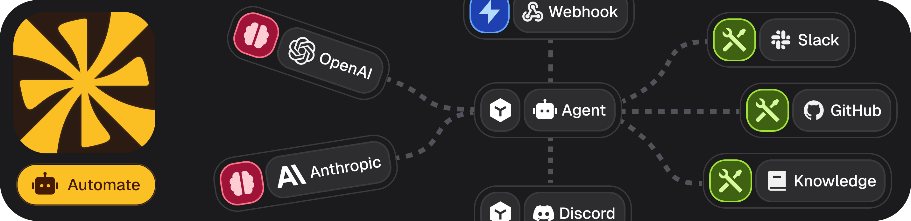

Workflow automation executor that runs on your machine. It connects to the Flowbaker platform to execute workflows with various integrations like Discord, GitHub, Gmail, and more.
<div align="center">

  [](https://golang.org/)
  [](https://discord.gg/flowbaker)

</div>

## Quick Start

### Installation

Download the latest binary from [releases](https://github.com/flowbaker/flowbaker/releases) or build from source:

```bash
git clone https://github.com/flowbaker/flowbaker.git
cd flowbaker
go build -o flowbaker cmd/main.go
```

### Setup

Start the executor and follow the setup prompts:

```bash
./flowbaker start
```

The setup will guide you through:
- Creating an executor ID
- Connecting to your Flowbaker workspace
- Generating secure authentication keys

Once setup is complete, the executor will run workflows assigned to it from your Flowbaker dashboard.

## Commands

- `flowbaker start` - Start the executor (auto-setup on first run)
- `flowbaker status` - Check executor status
- `flowbaker reset` - Reset configuration
- `flowbaker workspaces` - Manage workspace connections

## Building from Source

```bash
go build -o flowbaker cmd/main.go
```

Requirements: Go 1.25+

## Community

- [Discord](https://discord.gg/wDxHFkcbhD) - Get help and discuss
- [GitHub Issues](https://github.com/flowbaker/flowbaker/issues) - Report bugs or request features

## License

Apache 2.0
